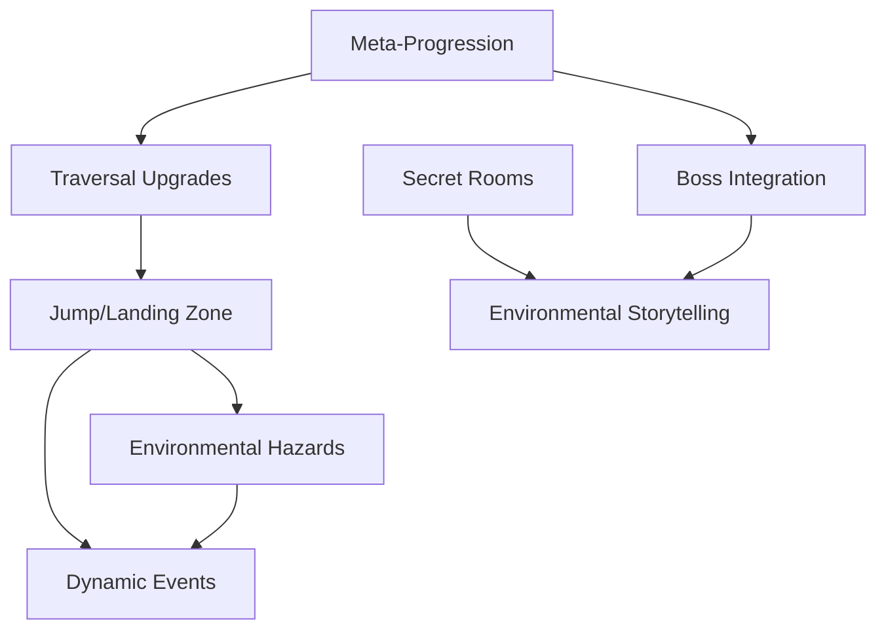

# World Generation Feature Gaps - Implementation Plans Summary

This directory contains detailed implementation plans for addressing the 8 identified feature gaps in MetVanDAMN world generation to meet genre expectations for roguelikes, roguelites, dungeon-crawlers, and open-world platformers.

## Implementation Plans

### High Priority (Immediate Implementation)
1. **[Jump/Landing Zone Traversal System](jump-landing-zone-traversal-system.md)** ⭐️
   - **Status**: Detailed plan complete
   - **Timeline**: 7 weeks (4 weeks MVP)
   - **Dependencies**: JumpArcSolver.cs, RoomNavigationGeneratorSystem.cs
   - **Impact**: Critical for AI navigation and genre compliance

2. **[Meta-Progression Hooks Integration](meta-progression-hooks-integration.md)**
   - **Status**: Plan in development
   - **Timeline**: 5 weeks estimated
   - **Dependencies**: GateCondition.cs, SectorRefineSystem.cs
   - **Impact**: Essential for roguelike progression feel

3. **[Secret Room Logic Expansion](secret-room-logic-expansion.md)**
   - **Status**: Plan in development  
   - **Timeline**: 4 weeks estimated
   - **Dependencies**: SecretAreaConfig, ProceduralRoomGeneration.cs
   - **Impact**: Core genre expectation for hidden content

### Medium Priority (Next Phase)
4. **[Environmental Hazards & Traps System](environmental-hazards-traps-system.md)**
   - **Status**: Architecture design needed
   - **Timeline**: 6 weeks estimated
   - **Dependencies**: BiomeArtProfile, new system development
   - **Impact**: Biome identity and challenge variation

5. **[Dynamic Events System](dynamic-events-system.md)**
   - **Status**: Architecture design needed
   - **Timeline**: 8 weeks estimated
   - **Dependencies**: RoomManagementSystem.cs, new event framework
   - **Impact**: Replay value and emergent gameplay

6. **[Boss Integration Enhancement](boss-integration-enhancement.md)**
   - **Status**: Plan in development
   - **Timeline**: 3 weeks estimated
   - **Dependencies**: RoomManagementSystem.cs (extend existing)
   - **Impact**: Biome-specific encounters and variety

### Lower Priority (Future Phases)
7. **[Traversal Upgrades Integration](traversal-upgrades-integration.md)**
   - **Status**: Architecture design needed
   - **Timeline**: 4 weeks estimated
   - **Dependencies**: Connection system, progression integration
   - **Impact**: Future-proofing for ability upgrades

8. **[Environmental Storytelling System](environmental-storytelling-system.md)**
   - **Status**: Architecture design needed
   - **Timeline**: 6 weeks estimated
   - **Dependencies**: BiomeArtIntegrationSystem.cs, new lore framework
   - **Impact**: Narrative depth and world coherence

## Implementation Strategy

### Phase 1: Foundation (Sprints 1-3)
Focus on systems that enhance existing functionality:
- Jump/Landing Zone Traversal (extends navigation)
- Meta-Progression Hooks (extends gate conditions)
- Secret Room Logic (extends procedural generation)

### Phase 2: New Systems (Sprints 4-6) 
Introduce completely new feature systems:
- Environmental Hazards & Traps
- Dynamic Events System
- Enhanced Boss Integration

### Phase 3: Polish & Integration (Sprints 7-8)
Complete the ecosystem with advanced features:
- Traversal Upgrades Integration
- Environmental Storytelling System
- Cross-system optimization and polish

## Success Metrics

### Genre Compliance Checklist
- [ ] **Procedural Variety**: Each run feels meaningfully different
- [ ] **Strong Biome Identity**: Visual, mechanical, and narrative distinctiveness
- [ ] **Traversal Variety**: Multiple movement options and skill expression
- [ ] **Secrets & Discovery**: Hidden content rewards exploration
- [ ] **Progression Hooks**: Clear advancement and unlocks
- [ ] **Dynamic Encounters**: Varied enemy/challenge placement
- [ ] **Replay Incentives**: Meta-progression and achievement systems

### Technical Validation
- [ ] All systems use ECS architecture with Burst compilation
- [ ] Performance scales with world size (target: <100ms generation time)
- [ ] Modular design supports future 3D tile expansion
- [ ] Integration preserves existing functionality
- [ ] Comprehensive test coverage for all new systems

### Player Experience Validation
- [ ] AI navigation feels natural and responsive
- [ ] Secret discovery is satisfying and learnable
- [ ] Hazards create meaningful challenge without frustration
- [ ] Boss encounters provide biome-appropriate variety
- [ ] Meta-progression creates long-term engagement goals

## Cross-System Dependencies

## Resource Requirements

### Development Team
- **Core Systems Developer**: ECS/DOTS expertise for foundational systems
- **Gameplay Programmer**: Game mechanics and player experience focus
- **Content Designer**: Biome-specific content and balance tuning
- **QA Specialist**: Cross-system testing and performance validation

### Timeline Overview
- **Total Implementation**: 8 sprints (16-20 weeks)
- **MVP Delivery**: 4 sprints (8-10 weeks) - Foundation systems only
- **Beta-Ready**: 6 sprints (12-14 weeks) - Core systems complete
- **Polish Complete**: 8 sprints (16-20 weeks) - All systems integrated

---

*This implementation strategy prioritizes systems that build on existing architecture while delivering maximum genre compliance impact. Each plan is designed to be modular and can be adjusted based on team capacity and priorities.*